# Introduction
Data visualisation is extremely important for communicating the results of your research, either in a
journal or to the general public, and for analysing and learning more about the characteristics of your
data and system (so-called "exploratory data analysis"). One of the most fundamental tools in data
visualisation is the two-dimensional plot (or graph). This tutorial will cover the basics of
two-dimensional data visualisation using a program called `gnuplot`; a program which allows you to
create high-quality, visually-pleasing figures and undertake robust post-hoc data analysis.

Why gnuplot? It's generally a good to separate data generation from data visualisation, so you can
generate your data once (whether it comes from a simulation or experiment) and then try multiple
different visualisation strategies without needing to re-run everything. Gnuplot is a standalone tool
which takes data in a relatively simple format and can produce a wide-variety of figures: 2D or 3D,
fancy or barebones and supports a lot of different output formats. Gnuplot is also highly scriptable:
its syntax is concise and makes simple tasks simple, so it can be controlled entirely through
command-line scripts. This is useful in a data visualisation program, as it makes it easy to exactly
reproduce figures, even long after they have been initially generated - a feature which can save a lot
of hair-tearing and frustration if you ever need to come back to a project after a long break. The final
major feature of gnuplot is the ability to do curve-fitting, both linear and non-linear, with a
relatively simple and intuitive syntax. 

All of these features make gnuplot a very powerful tool for data visualisation and analysis. It is by no
means the be-all and end-all (if you need to do a lot of complicated post-processing before plotting
then you may be better served by using Python), but gnuplot is a good choice for a lot of workloads as
it is simple enough to rapidly explore multiple visualisation options while still being capable of
making publication-quality figures once you've decided what you want.

This guide covers the installation and usage of gnuplot, with a particular focus on 2D visualisation and
data analysis. It is consists of a handful of sections detailing some of the more useful features of
gnuplot, as well as some case-studies using real data to demonstrate how you might use these features in
the real world. Finally, there's a list of resources on data visualisation and analysis at the end,
which are worth reading if you want to learn the fundamentals of data science and statistics.

## Table of Contents
{:.no_toc}

* TOC
{:toc}

# Installing gnuplot
Installation instructions depend on which operating system you're using:
  * Windows: pre-compiled binaries are available on the [gnuplot Sourceforge 
  repository](https://sourceforge.net/projects/gnuplot/files/gnuplot/) (go to the folder for the latest 
  version and look for the file ending in `-win64-mingw.exe`).
  * Mac: install with [Homebrew package manager](https://brew.sh/), or get pre-compiled binaries from 
  [Northwestern 
  University](https://csml-wiki.northwestern.edu/index.php/Binary_versions_of_Gnuplot_for_OS_X) 
  (binaries compiled on OS X 10.15.6 (Catalina)).
  * Linux: use your distribution's package manager (e.g. `sudo apt-get install gnuplot` on Ubuntu, `sudo
    dnf install gnuplot` on CentOS, Red Hat or Fedora).

Furthermore, gnuplot is installed on most clusters, so you can use it remotely if all else fails. You'll
need to enable GUI-forwarding (commonly called *X11-forwarding*, after a common Linux GUI backend)
on the cluster to if you want to interact with the plots you make (saving to an image file should always
work). If the cluster you're using supports it, you can pass the `-X` flag when you log in with SSH (so
your login command would become something like `ssh -X username@gadi.nci.org.au`) which will allow you
to run graphical applications like gnuplot on the cluster. Beware that not all clusters support this
option and it will be extremely laggy as the graphics need to be sent over the internet to your
computer, so use this option sparingly.

# Getting help
I have tried to include most of what you'll need for basic gnuplot use in this tutorial, but some
commands will depend on which platform you're using or might have too many configuration options to
list without breaking the flow of the document. In these cases there are two main places to get help 
for gnuplot:

- [Gnuplot manual](http://gnuplot.info/docs_5.4/Gnuplot_5_4.pdf) - gnuplot has an extensive manual,
  which serves more as a reference manual than a tutorial (it's a good place to look things up, but not
  a great way to learn the basics).
- Gnuplot interactive help menu - type `help` at the gnuplot prompt to bring up a (verbose) help menu.
  You can also go straight to help on a specific command by typing `help <command>`, e.g. `help plot` or
  `help plot using`. This menu is available from inside an interactive gnuplot session and should be
  your first point of reference for unfamiliar commands or options.
- If you want to generate a specific type of plot which is not mentioned in this tutorial, have a look
  at the extensive demo scripts on the [gnuplot sourceforge page](http://gnuplot.sourceforge.net/demo/).
  Their documentation is a little bit sparse, but the example scripts should give you a good jumping-off
  point which you can then modify for your own use.

# 2D plotting
## Plotting 2D functions
As you might expect from the name, the most important command for 2D plotting in gnuplot is `plot`.
`plot` takes many options and can create many different types of plots, so it's worth familiarising
yourself with a broad outline of what's possible. I will provide example gnuplot commands and data
sets throughout this section, as well as examples of the plots they produce; I encourage you to follow
along and experiment with the commands and options as you read.

First off, `plot` can take both both built-in and user-defined analytic functions to plot.
For example, the function `2*sin(x)` can be plotted by doing:

```
f(x) = 2*sin(x)
plot f(x)
```

Where the first line defines a function called `f(x)` and the second line plots it. It is not strictly
necessary to store the function in a variable before plotting it; you can just do `plot 2*sin(x)` if you
prefer. If you run the above commands as-is, you should see something like the following figure appear
on your screen:


Gnuplot has built-in support for a *lot* of functions, so check the help menus `help plot functions` and
`help expressions functions` for a list of plotting options and built-in functions, respectively.

## Plotting data from a file
Gnuplot also has the ability plot data which you supply to it in a file. Files must be plain-text 
(although some binary formats such as Fortran output are supported), and must be formatted into regular
columns. For example, a (short) data file might look like:

```
# Lines starting with a "#" are comments and will be ignored by gnuplot
# x   y  
1   2  
2   4  
3   6  
4   8  
```

If if we save this file as `data.dat`, then we can plot its contents by typing `plot "data.dat"`. 
Note that the quotes are significant: the filename must be enclosed in quotes or gnuplot will treat 
it as a variable. The resulting plot should look something like:


 
Data files can contain multiple columns and you can specify which columns to plot with the `using` 
statement as a modifier to `plot`. For example, if we have a new data file (again saved as `data.dat`):

```
# t x y
1 6 4
2 4 16
3 2 32
```

If we wanted to plot `t` vs `y` (leaving out the `x` column) then we would run the command 
`plot "data.dat" using 1:3`. If we don't manually specify which columns to use, then `plot` will use 
the first two columns (equivalent to `plot "data.dat" using 1:2`).

We're not limited to just plotting the data as it appears in the data file. We can also perform 
element-wise transformations on data columns, such as multiplying all elements of a column by a 
constant before plotting. In order to do this, we must enclose the whole mathematical statement in 
brackets, and preface each column number with a dollar-sign ("$") to indicate that gnuplot should treat 
it as a column identifier rather than a regular number. 

For example, if we have the data file above with three columns `t`, `x` and `y` and want to plot `t` 
vs `x*y`, then the relevant gnuplot command is `plot "data.dat" using 1:($2*$3)`. This command will
produce an output which looks similar to:


### Errors and uncertainties
2D plots can also contain error bars, which is important for visualising real-world data from
experiments or sophisticated simulations. One way to do this is to calculate symmetric errors in the
dependent variable (usually called `y` in examples), such as a confidence interval based on the
assumption of normally distributed errors. In this case, we might want to plot `x` vs `y ± delta_y`.
Given a data file with the following format:
  
```
# x y delta_y
1 4   1.2
2 16  2.4
3 32  1.5
```

we can generate a plot with symmetrix error bars via the command 
`plot "data.dat" using 1:2:3 with errorbars`, which will produce a plot like the following:


It is also possible to specify separate `min` and `max` bounds on the uncertainties, as in the following
file:

```
# x y y_min y_max
1 4   3.9   4.2
2 16  15    17
3 32  20.2  33.1
```

We would then plot this with the command `plot "data.dat" using 1:2:3:4 with errorbars`, which will
generate something like the following figure:


### Plots with multiple curves/data sets
Gnuplot can produce plots with multiple curves/sets of data points residing on the same set of axes by
providing multiple arguments to `plot`, separated by commas. The syntax is very similar to the basic
plotting we've already seen, and supports the same options. For example, we if we wanted to plot two
sets of data points from two different data files, the command would look something like
`plot "data1.dat" using 1:3, "data2.dat" using 1:2:3 with errorbars` and produce output like:

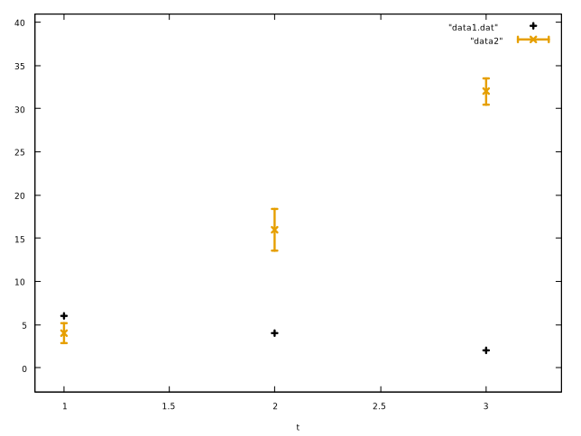

Gnuplot will automatically generate a key (or legend) showing which points correspond to which data
sets. It's important to note that this only works when we pass multiple data sets to the *same* `plot`
command. Each call to `plot` overwrites the existing figure, so the (superficially similar) set of
commands:

    ```
    plot "data1.dat" using 1:3 
    plot "data2.dat" using 1:2:3 with errorbars
    ```

will first plot the first data set, before erasing it and plotting the second, resulting in only one set
of points being plotted. This is probably not what you want to do when comparing data.

### Getting your data in the right format
As we've seen, gnuplot requires data to be in a relatively easy-to-parse format before you can work with
it. It can not, for example, read data from a spreadsheet program such as Microsoft Excel, nor can it
read from an output file generated by simulation software like LAMMPS or VASP. Fortunately, it's usually
fairly straightfoward to wrangle data into the right format. What follows are examples of some programs
you might use and how to integrate their output with gnuplot. This list is a work in progress, so feel
free to ask if there's another program you'd like to see added to the list.

- Microsoft Excel:
    * Desktop app: follow the instructions on [this page](https://support.microsoft.com/en-us/office/import-or-export-text-txt-or-csv-files-5250ac4c-663c-47ce-937b-339e391393ba) 
    to export your data to a text file. By default, Excel will use comma-separated values (CSV) as the 
    output format, but you can change this to use spaces in the "Export" menu (or set the separator to
    "," in gnuplot). It's also a good idea to use a hash symbol ("#") for text/comments, which you can
    set in the "Export" menu.
    * Office365 (web app): at the time of writing, the Office365 web app does not allow you to export
      data to a text file. You'll either need to use the desktop app, or transfer your spreadsheet to
      Google Sheets and export from there.
- Google Sheets: within the spreadsheet containing the data you want to export, go to 
 "**File \> Download \> Tab-separated values (.tsv, current sheet)**", the file should download 
 automatically.

## Configuring plots
Plots have a lot of properties which can be modified on a per-data basis. The two most common options
are to set a title for the data-set, which will appear in the key/legend by adding `title "Some
string"` to the plot command. Can also toggle whether to plot disconnected points or with connected 
lines by adding `with lines` to the plot command (points are the default and doesn't need to be
specified). Can also specify `linecolor` (note the American spelling) individually for each line.
As an example, we can do `plot "data.dat" using 1:3 with lines title "My data"`. Can see
the whole list of modifiers in the help menu: `help plot` and `help plot with`.

Axis/plot-wide properties like titles, labels and the location of the key/legend are modified for the 
whole plot at once via the `set` command. This command has the syntax `set <property> <arguments>`. 

Some useful options you're likely to want to set are:

  * `title`: Plot title.
  * `xlabel`, `ylabel`: labels for x- and y-axes.
  * `grid`: overlay a grid on the plot.
  * `xrange [<min>:<max>]`, `yrange [<min>:<max>]`: set range of x- or y-axes.
  * `autoscale`: set whether or not to automatically scale the plot's axes with the data range. This
    setting is enabled by default, but will be disabled if `xrange` or `yrange` are set.
  * `logscale`: switch from linear to logarithmic scale plot. Can set logscale for only one axis at a
    time by doing `set logscale y` (default is to set for both `x` and `y` axes).

Properties can be undone via the `unset` command. E.g. `unset title` removes the current plot title.
If you need to go back to the default settings, then the command `reset` will unset all plot-wide 
properties.

You can also control *where* to send the plot, such as whether to plot on the screen or save to a file,
by
setting the *terminal* in your gnuplot session. "The terminal" is gnuplot's terminology for any kind
of device which can accept a graphical plot (although funky options like printing to ASCII text files
are possible) and is distinct from the meaning of "terminal" you might be familiar with from using the
command-line. Terminals in gnuplot can generally be split into two categories: interactive terminals 
and files. Most gnuplot installations will default to an interactive terminal, which might be called
something like "x11" or "qt", depending on the operating system. Gnuplot will print the terminal when
you first load an interactive session (look for a message like `Terminal type is now 'qt'`), but you
can also print the terminal type at any time via the command `show terminal`. Some terminals have
extra options like resolution, so check the help menu `help terminal <help>` if something doesn't look
right.

You'll need to change the terminal before you can send your plot to a file; this is achieved through
the command `set terminal <term>`. A list of available terminals, along with a short description, can
be found by typing `set terminal` without any options. File-based terminals also require you to set a
filename for the plot via the command `set output <filename>` (this command has no effect for
interactive terminals, so you should only run it after switching terminals.

As a concrete example, suppose we want to save one of our plots to an SVG (Scalable Vector Graphics)
file called `my_plot.svg`. We'd first need to set the terminal to the right option, then set the
output file, before finally plotting (or replotting) the data. The full sequence of commands will look
like:

```
set terminal svg
set output my_plot.svg
plot "data.dat" using 1:2:3:4 with errorbars
```

It's important to remember that modified properties only take effect once you plot the function. 
If you've already got a plot and want to change some properties, then you'll need to run `replot` 
before the changes will take effect. This will reproduce the most recent `plot` command (including
options like error bars), but any changes you've made to the plot-wide settings (like terminal or plot
title) will take effect since this is a new plot.

Some other useful configuration options are:

- You can change which character gnuplot will use to separate entries in a data file (the default is
  whitespace). For example, if you wanted to plot data from a CSV file then you'd do: 
`set datafile separator ","`. 
- Set zero axes (i.e. dashed lines at `x=0` and `y=0`) via `set zeroaxis` Can also use `set xzeroaxis`
  or `set yzeroaxis` for x or y lines only.
- The location of the key can be changed from the default (top right) with the command `set key
  <location>`, where `<location>` can contain some combination of `top`, `bottom`, `left`, `center` and
  `right`. For example, to set the key location to the top left of the plot, you'd do `set key top
  left`. Can also put it outside the plot by doing `set key right top outside`
    * Can also make the spacing between key entries larger or smaller `set key spacing 2`
    * Keys can have titles `set key title "The legend"`
- Can set tics either explicitly `set ytics (0, 1, 2, 3)` or specify spacing `set ytics 0.1`
    * Can also set minor tic marks `set mxtics 5`, where the number indicates the number of minor tics
      to include between major ones
    * `set grid` also respects minor tics
    * Sometimes only want to have tics on one side of the plot, can do this with `set ytics nomirror`
- Arrows are useful to point out important bits of the graph. Need to manually specify the positions of
  both the label and the arrow. The label's position starts at its bottom left. We'd first want to do 
  `set label "A label" at 0.5,0.5` and then do `set arrow from 1.0,0.75 to 2.0,1.5` 
- Rapidly varying functions can look jagged, since gnuplot only samples at a rate of 100 points per tic
  mark. Can be useful to increase this by doing `set sample <num_samples>` and then plotting (or
  replotting). NOTE: this only works for builtin functions and has no effect on data taken from a file.

It can be annoying to have to set all the configuration options every time you want to plot something,
especially if you have a common set of options you reuse for all plots. Fortunately, gnuplot has a way
to carry configurations over between sessions - the startup configuration file. On Linux and Mac, this 
file is located in your home directory and is called `~/.gnuplot` (you'll have to create it if it 
doesn't exist), while on Windows the file is called `GNUPLOT.INI` in the directory
`<root>\\Users\\<username>` (where `<root>` is the drive letter Windows is installed on (usually `C:`))
[^1].
Gnuplot reads and
executes the contents of this file at the start of every session, so you only need to specify the
options once, manually changing them only when you want to do something special.

[^1]: This location may or may not work on newer versions of Windows, so you may need to follow this
    [Stack Overflow answer](https://stackoverflow.com/questions/15311035/gnuplot-initialization-in-windows-7) 
    if the default location doesn't work.

## Case study 1: molecular dynamics energies
Let's look at a concrete example using real-world data to tie together what we've learned so far. The
data in this section comes from simulating a Lennard-Jones (LJ) fluid under shear flow in 
[LAMMPS](https://lammps.sandia.gov/) and outputting the temperature, kinetic energy and potential energy
at each time-step. Here is a sample of the output data, which is saved in the file "MD_energy.dat": 

```
#Step Temp KinEng PotEng                                                       
0         1.44    2.1589453            0
1    1.4399848    2.1589225            0
2    1.4399377     2.158852            0
3     1.439859    2.1587338            0
4    1.4397484    2.1585681            0
5    1.4396061    2.1583548            0
...
100    1.1114163    1.6663104   0.43059789                                
...
900    1.0989108    1.6475614   0.41621329                                
...
998    1.1142942    1.6706251   0.46925806
999    1.1154457    1.6723515    0.4671758
1000    1.1188787    1.6774986   0.46154465 
```

I've elided most of the points in the data set for readability, but if you want to download the whole
set to follow along with this example, you can find it at this link: 
<https://gist.github.com/emilyviolet/5c4fe0dcb369c5cdff06ccc658597120>

As a first step, we might want to investigate how the energy of the system changes over time. 
This means we'll want to plot time-step on the x-axis and the kinetic and potential energies on the 
y-axis, preferrably on the same set of axes. To do this in gnuplot,
we'll need:

* Line plots to make the trends easier to follow,
* Labels for the two lines (the key), and
* Plot-wide labels: title and axis labels.

We'll also introduce the interface for using scripts to automate plotting in this example, since this
makes it easier to replicate and compare plots than doing everything interactively. 

Let's start with plotting the energies as two different curves. Save the following script to a text file
with the title `MD_energy.gp`:

```
set xlabel "Timestep"                                                          
set ylabel "E (LJ-units)"                                                      
set title "Kinetic vs potential energy for LJ fluid under shear"               

# Need to escape line breaks with backslash, since gnuplot expects plot
# commands to appear on the same line
plot "MD_energy.dat" using 1:3 with lines title "Kinetic energy", \
"MD_energy.dat" using 1:4 with lines title "Potential energy"
``` 

We can tell gnuplot to read commands from this file by running the command `load "MD_energy.gp"`.
Running commands from a file will generally produce the same plot as if you typed each of the lines in 
the script one after the other in an interactive session, so saving plot instructions in a script is
simply a way to save the logic of generating a plot for easier re-use. 

Running the above script will produce output which looks something like the following:

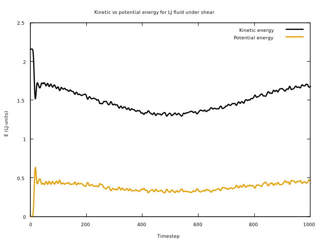

This is all well and good, but it doesn't capture all the information we might want about the system: it
would also be useful to include the total energy of the system on the same plot. Even though the data 
file doesn't contain a column for the total energy at each time step, we know that the total energy is
defined by `E_total = kinetic + potential` so we can get what we need by plotting the sum of columns 3 
and 4. The command to do this is `plot "MD_energy.dat" using 1:($3 + $4) title "Total energy"`, 
and gives the following plot:
  
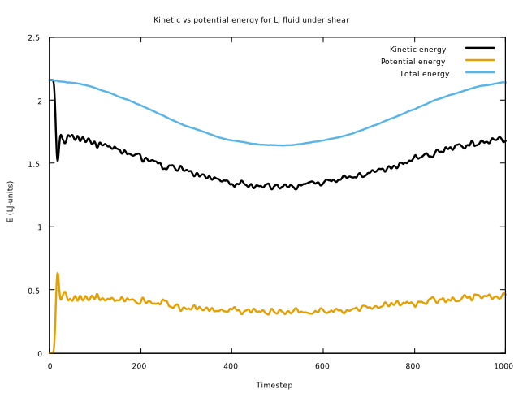

This gives a clear indication of the total energy of the system (e.g. it isn't constant in an NVT
ensemble), even though it is derived from existing data - it's much easier to have gnuplot transform and
visualise some relationship between data points than to do it in your head.

Finally, notice that the kinetic and potential energy curves are quite spiky. This is an inherent
feature of the data, but it might make it more difficult in some cases to see broad trends so it
can be useful to smooth out the data. Gnuplot has the ability to do this via the `smooth` modifier to
the `plot` command, and has several different smoothing schemes built in. There are several
"statistical" smoothing options such as by generating a cumulative distribution function or ensuring the
data are unique (with each x-value corresponding to at most one y-value), but the one we're interested
in here are the spline-based options, specifically `smooth bezier`. This option approximates the data
with a [Bezier curve](https://en.wikipedia.org/wiki/B%C3%A9zier_curve) (a set of piecewise 
polynomials), so provides a nonlinear trend-line fitted to noisy or spiky data. 

Let's plot a pair of Bezier curves to smoothly the kinetic
and potential energies as grey to make it clear that they are only an approximation of the
real data. I've also decided to use dashed lines for the kinetic and potential energy to make the
smoothed trend-lines easier to see. Finally, the key now has an extra item to identify the smoothed
lines, so I've moved it to the center-top position to avoid overlapping with the plot.

To make this plot, we add a few new lines to the plotting script:

```
set xlabel "Timestep"                                                          
set ylabel "E (LJ-units)"                                                      
set title "Kinetic vs potential energy for LJ fluid under shear"               

set key top center

# Standard plot                                                                
plot "MD_energy.dat" using 1:3 with lines title "Kinetic energy" dashtype 2, \
"MD_energy.dat" using 1:4 with lines title "Potential energy" dashtype 2, \
"MD_energy.dat" using 1:($3 + $4) with lines title "Total energy", \
"MD_energy.dat" using 1:3 with lines title "" smooth bezier linecolor "#595959" , \
"MD_energy.dat" using 1:4 with lines title "" smooth bezier linecolor "#595959"
```

and end up with the following plot:

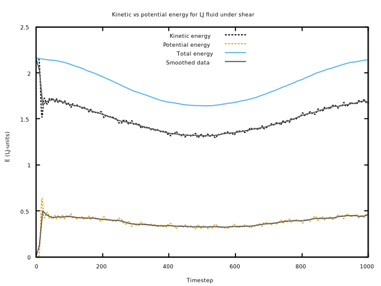

We can pretty clearly see both the original, "real" data (the kinetic, potential and total energies) as
well as the smoothed interpolation by Bezier curves. The curves are plotted in different colors so the
smoothed data looks (in grey) qualitatively different to the base data (in color). It does add some
level of visual clutter, though, so the decision on whether to plot the smoothed datawill depend on the
specifics of your data set.

Beware though: smoothing and interpolating the data can sometimes make underlying trends easier to see, 
but can also obscure real features or give the impression of trends which aren't really there if used
injudiciously. As with any visualisation technique, it's important to think about the nature of the data
you're visualising (e.g. does the physics of the situation tell you anything about trends and
relationships you should expect) before jumping in to it. See [chapter 14 of the textbook by 
Wilke](https://clauswilke.com/dataviz/visualizing-trends.html) for a more detailed discussion of the 
benefits and downsides of this sort of visualisation technique.

# Plot styling and customisation
Basic gnuplot looks quite spartan, but its strength is that it's highly customisable - you can make your
gnuplot figures follow pretty much any style you like. In this section, we'll look at changing line
styles, colors and widths in gnuplot.

First, it's important to note that the available style options depend on the version of gnuplot you have
installed, as well as the terminal to which you're sending the plot. The two ways to see what's
available are through the help menu option `help set style`, or by having gnuplot draw a so-called
"test page" with the command `test`. On my computer (CentOS 8 Linux), the test page looks like this:

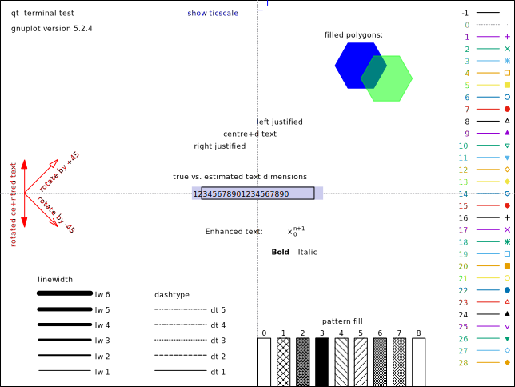

Among other things, this page shows the different line styles, point styles, line widths (abbreviated as 
`lw`), colors and
so on, each labeled by an integer index. This index is used with `plot with` and `set style` to refer
to a specific style. For example, if we wanted to plot some data points using style 5 (empty squares)
we could do:
```
plot "data.dat" with points pointtype 5
```

## Colours

If we wanted instead to use a specific line-color for our plot, we can use the `linecolor` (`lc`)
attribute, which can take either a pre-defined color or an arbitrary hex-code. For example, if we wanted
to plot a curve in "UQ Purple", which is defined by the RGB components `(81, 36, 122)`. The easiest way
to use this color in gnuplot is to convert the RGB components to a hexadecimal code ("hex code"), which
you can then use the syntax `plot <data> with lines linecolor "#<hex>"` (the hex code must be prefaced
by either a "#" or "0x" and be enclosed in quotes). 

The DuckDuckGo search engine has a
convenient built-in tool to convert between RGB (or the alternative Hue-Saturation-Value (HSV) scheme)
and hexadecimal representations, which can be found at [this
link](https://duckduckgo.com/?t=ffab&q=rgb+to+hex+color+converter&ia=answer). Feeding the RGB values of
UQ Purple into this tool gives a hex code of `51247a`, which we can now use in gnuplot. For example, to
plot a `sin` curve with this color, we can now do `plot sin(x) with lines linecolor rgb "#51247a"`,
which gives the following figure:

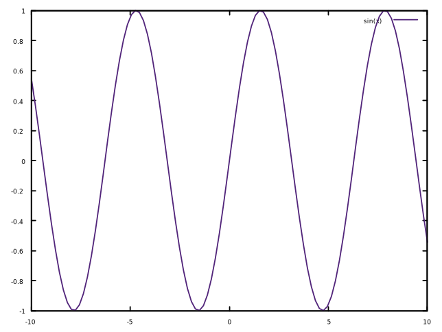

## Customising gnuplot

Gnuplot lets us store and read customisations from a file to re-use across plots. This is a good way to 
ensure
consistency across multiple plots, especially if submitting to journals which require a certain style
for figures. Gnuplot keeps an internal list of line styles which it cycles through when plotting lines
without explicit style options. This list can be modified through the `set style line <num> <options>`
command, which will override the default style for that line number. Once this is loaded, gnuplot will
use line style 1 for the first data set in a plot, then line style 2 and so on. Have a look through
the help option `set style line` for the available options.

If you save these options to a file, you can read it with the commands:

```
load "style_file.gp"
set style increment user 
``` 

One other important consideration is accessibility; ensuring your figures are accessible and
interpretable by people with colorblindness or other visual impairments. This is an area which many
people overlook, despite the fact that between 4-10% of the male population has some form of
colorblindness (if you've given a conference presentation to a reasonably large audience, it's almost
guaranteed that at least one person in the audience has colorblindness). 

Fortunately, much research and engineering work has been done on accessible graphics, so the 
best-practices are quite easy to follow. Here are the main points to keep in mind when visualising your
data:

- Consider using line or fill patterns (e.g. dashed vs solid lines) to differentiate data sets, as
this does not rely on color vision at all.
    * Most output file types in gnuplot have an option to output to greyscale, which is more
      accessible to people with color-vision deficiency (almost by definition). For PNG and PDF output
      via the Cairo rendering library (a common option on Linux and Mac), this is enabled via the "mono"
      option when setting the terminal, e.g. `set terminal pdfcairo mono`.
- Use a colorblind-friendly palette for your graphs by default. [This blog post](https://thenode.biologists.com/data-visualization-with-flying-colors/research/)
has a great roundup of colorblind-friendly palettes. As we'll see below, gnuplot even has some
built in and ready to go.
    * Avoid using red and green to differentiate between data sets, since red-green colorblindness 
    is the most common form of color-vision deficiency. Unfortunately, some installations of 
    gnuplot use red and green as the default color scheme, so it's a good idea to change your 
    default palette.
- Use thick lines for plots used in presentations and avoid using light line colors like yellow 
on a white background. Consider using a thick/large print font for labels and major axis tic marks.

Even more fortunately, gnuplot has a built in option to use an accessible color scheme, albeit a
poorly-advertised one. 
All you need to do is run the command `set colorsequence podo` to tell gnuplot to use this 
color scheme. If you want to use thicker lines for all plots in a figure then you can also use 
`set termoption linewidth <width>`, substituting `<width>` for your preferred thickness (I find 1.5 is a
good default. It is tedious to set these options every time you want to plot something, so I recommend
adding them to your `~/.gnuplot` file (or `GNUPLOT.INI` if you're using Windows) to make them the
default settings. For example, my `~/.gnuplot` file looks like:

```
set colorsequence podo
set termoption linewidth 1.5
```

This color scheme only includes eight colors and so cannot be used for plots containing more than
eight different data sets. However, using too many different colors can actually make the visualisation
harder to interpret, so if you need to have more than eight data sets then you're probably better off
using something other than colors (e.g. different line patterns) to differentiate between categories
of data.

One thing to keep in mind that different colors will look better printed, while others are better 
suited to being viewed on screens (projectors are a different story yet again). It's hard to give 
specific
guidelines for all possible media, but some general rules are that you should use darker colors and
thicker lines for figures which will be viewed on a projector compared to figures meant for paper or
screens. Titles, axis labels and elements of the plot's key should also use a larger font if they are to
be used in a presentation, otherwise audience members at the back of the room (or who may have visual
impairments) won't be able to read them. Whatever you do, always make sure to see how the plot looks in 
the intended medium *before* publishing it; your audience/reviewers will thank you for it.

Finally, I strongly recommend saving graphs to a vector graphics format if plots are to be included in 
papers, theses or presentations. This is because vector graphics formats can scale up or down to 
arbitrary resolution without getting blurry, whereas raster graphics formats like png turn into pixel
soup if you make them too much larger than their original resolution. Vector graphics are the only way 
to ensure figures stay crisp at all resolutions without requiring enormous file sizes (e.g. no need to 
make a 4 megapixel png) and are well supported in most LaTeX styles.

Gnuplot (usually) supports svg, pdf, eps (encapsulated postscript) and LaTeX, depending on the
platform. The best choice of format will depend on where you're planning to use the graphics (e.g. a
website will probably not support LaTeX graphics), but svg is usually a good default choice.

## Case study 2: bar charts
Line and scatter graphs are very useful when visualising purely numeric data where we can impose some
kind of ordering on the points (e.g. time-series data). This is not the only kind of 2D visualisation
you're likely to run into, however. Sometimes you need to visualise data where one variable represents
*categories* of things, such as this case study which aims to visualise the performance of different
C++ compilers on a standard suite of benchmarks.

In this case, we want to visualise how the speed of the generated code is affected by choice of compiler
and compile-time options for a suite of 8 benchmarks. In this case, we have three variables to
visualise: compiler (GCC or Intel, plus whether or not to enable vectorisation), benchmark (which is a
small program designed to test a particular computing pattern), and
run-time. We have two categorical variables and want to compare a numeric variable, so a bar chart is a
good choice of visualisation.

In order to make a bar chart in gnuplot, we'll need to introduce a few new concepts which aren't
(usually) present in line charts:

- The visualisation needs to be boxes whose height is given by columns in a data file, rather than
points or lines.
- The axis tic labels should be strings, rather than numbers. These strings should ideally be read
from the same data file as the numeric data.
- We want to cluster related data boxes together, so that all results from each benchmark are more
easily compared.

The data file we're drawing from needs to be in a slightly different format than we're used to, as well.
The data needs to be organised with labels for the x-axis in one column and the corresponding wall time
data in the rest. Here's the data we'll be using in this case-study:
```
# Walltime (s)
# "Benchmark name"  "gfortran"      "gfortran+SIMD"      "ifort"       "ifort+SIMD"
IS 1.23 1.34 1.53 1.36
EP 26.41 32.39 18.29 15.84
CG 40.76 47.26 46.76 46.55
MG 18.84 19.1 19.77 20.16
FT 43.53 43.87 39.76 40.82
BT 213.1 183.07 217.99 169.26
SP 145.23 144.26 148.58 145.46
LU 105.04 100.12 117.66 106.71
```
We can see immediately that the first column contains the names of the benchmarks in the test: "IS",
"EP", "CG", "MG", "FT", "BT", "SP" and "LU" (if you're interested in what the names mean, they're 
abbreviations from [NASA's Parallel Benchmark Suite](https://www.nas.nasa.gov/publications/npb.html)).
Each of these benchmarks then has four run-times, which correspond to the time taken to execute the
benchmark when it's generated by the corresponding compiler. These will be our bars, color-coded by
compiler type.

That's the data, so what about the chart itself? Bar charts are qualitatively different than line
charts, so we'll need to tell gnuplot to treat the data differently than simple numeric data. This is
achieved via the `histogram` data and plotting style, which we set via the following commands:

```
set style data histogram
set style histogram cluster 
set style fill solid
```

The first of these commands tells gnuplot that the input data is organised by categories, the second
sets the plot to use boxes rather than lines and that the data should be clustered by categories, and
the third fills in the boxes with solid colors to differentiate the clusters. 

Finally, we need to plot the data and specify where to get the labels for the x-axis tics from. We can
do this by adding an extra column to the plot command as follows:

```
plot "benchmarks.dat" using 2:xtic(1) title "gfortran"
```
which plots the run-time data in the second column, using the first column (the benchmark names) as the 
x-axis labels, and gives it the title `gfortran` in the key. This description is somewhat abstract, so
here is the graph generated by the above command to more clearly show what it does:


We can add the data for the rest of the compilers by extending this plot command to plot each successive
column, which will look something like the following script:

```
set xlabel "Benchmark name"
set ylabel "Walltime(s)"
set title "Compiler benchmark for NPB Fortran benchmark suite"
set key top left

set style data histogram
set style histogram cluster gap 1 # Leave a gap between successive clusters
set style fill solid
set boxwidth 0.9

plot "benchmarks.dat" using 2:xtic(1) title "gfortran", \
"benchmarks.dat" using 3:xtic(1) title "gfortran + SIMD" , \
"benchmarks.dat" using 4:xtic(1) title "Intel fortran" , \
"benchmarks.dat" using 5:xtic(1) title "Intel fortran + SIMD"
```

The full output of this script is shown below:


This script produces a bar chart with all the properties we laid out at the start of this example: the
data are clustered so that run-times for the same benchmark are all adjacent to one another, the results
for each compiler are differentiated by the color of their bars, and the x-axis has appropriate labels.

# Multi-panel figures (multiplots)
Gnuplot supports multi-panel figures (multiple separate plots and axes in one figure), which can be
useful when visualising a large number of data sets, as plotting them all on the same set of axes can
look busy and hard to interpret. It's fairly easy to set up multiplots in gnuplot via the `set multiplot
layout <vertical,horizontal>` command, where `vertical` and `horizontal` are the number of axes to plot
in the vertical and horizontal sections, and thus control the layout of the figure.

As an example, the following set of commands generates a multiplot with two plots stacked on top of each
other (a vertical layout):

```
set multiplot layout 2,1 # Vertical layout with 2 plots
plot sin(x), sin(2*x)
plot cos(x), cos(2*x)
```
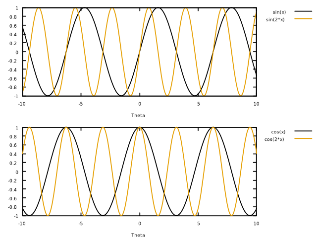

Notice how each plot command is mapped to a different set of axes within the multiplot. If we wanted to
make a layout with more plots, then we simply add in more calls to `plot`. Be careful though, as gnuplot
will not warn you if you have more `plot` commands than sets of axes - it will simply wrap back around
and start plotting on the existing axes, which looks extremely ugly. Consider the following script,
which attempts to plot three things on two sub-plots:


```
# Deliberately bad example, do not do this
set multiplot layout 2,1 # Vertical layout with 2 plots
plot sin(x), sin(2*x)
plot tan(x)
plot cos(x), cos(2*x)
```

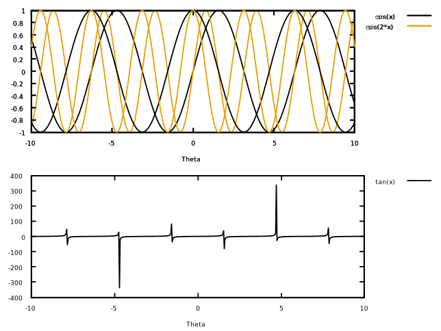

In addition to having too many lines on the top plot, the legend is completely broken as gnuplot has
attempted to render two different keys in the same location at the same time. This problem is fairly
easy to avoid, but highlights the need to take extra care with multi-plot figures.

Gnuplot attempts to automatically line-up the x-axes to make it easier to compare the
two plots, but it cannot do the same with the y-axes (since the plot has a vertical layout), making
direct comparison of amplitudes difficult. For this reason, it's usually a good idea to enable axis
grids on multiplots as they make it possible to line up exact x-y-values and compare between plots. This
is achieved by adding `set grid` before the plot commands. Grids add a lot of visual noise to the plot,
so an alternative to the fully x-y grid is to only plot horizontal lines at each of the y-axis tic
marks, since we can directly compare x-axis positions without a grid overlay. In this case, you can add
a "grid" with only y-axis marks by using `set grid ytics`, which produces the following output:

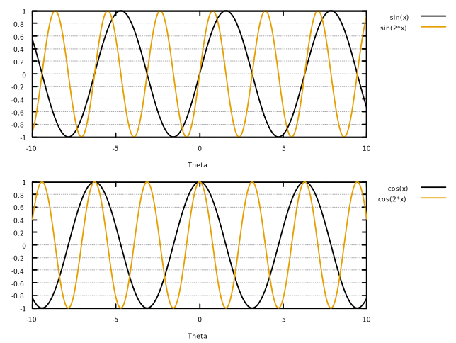

It's also very important to ensure that the axis ranges (both `x` and `y`) are the same for each plot 
in the figure, otherwise the reader is likely going to misinterpret your data. The best way to achieve
this is
to first plot your data separately and figure out the x- and y-ranges which will best fit all the data
sets, then do `set xrange [<min>:<max>]` and `set yrange [<min>:<max>]` before setting up the multiplot.

Note that attributes `set` before the `plot`
commands will apply to all sub-plots; if you only want to set the grid for a subset
of the plots then you'll need to enclose the desired `plot` commands in a pair of `set <thing>` and
`unset <thing>`, like so:
```
set multiplot 3,1  # Vertical layout with three plots
plot sin(x), sin(2*x)

set grid # Only draw a grid around the middle plot
plot tan(x)
unset grid

plot cos(x), cos(2*x)
```
This will produce output like the following:

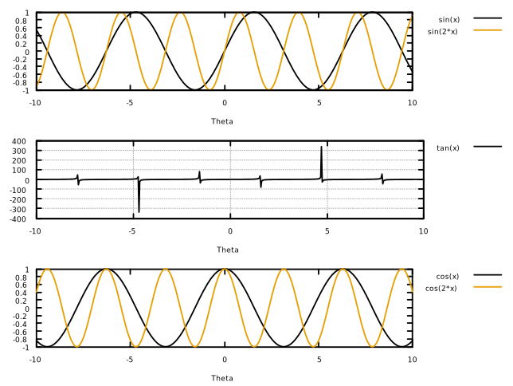

This technique can be used with any parameter controlled by the `set` command (e.g. titles, axis scales)
and allows for very fine-grained over the individual plots making up a figure.

# Curve fitting
The last topic we're going to cover in this guide is curve-fitting: finding a function which closely
approximates the form of some data. The most common form of this is a linear regression, where we try to
fit a straight line of the form `f(x) = a*x + b` using the method of least-squares. This method is a
robust tool in statistical analysis and can be useful when exploring some data (e.g. to see if it has
the expected functional form), as well as a way to make quick and easy predictions about hypothetical
data outside the set (e.g. extrapolation or interpolation). 

Gnuplot requires two things when performing a fit: the functional form of the fit and the source data to
be approximated. The source data can come from a text file, and must take the same form as when
supplying data for plotting. 
To define the functional form (i.e. the model we expect the data to fit), you'll need
to define a function with at least one free parameter, which can have whatever name you like. For
example, to define a linear fitting function, we would do:

```
f(x) = a*x + b
```

We can then use this function with the `fit` command, which has the following syntax:

```
fit f(x) "data.dat" using <cols> via <vars>
```

where `<vars>` is a comma-separated list of the free parameters which gnuplot will vary to find the best
fit. So given our linear function, we would do:

```
fit f(x) "data.dat" using 1:2 via a,b
```

Let's look at a concrete example of performing a linear regression. Consider the following data:
```
#data.dat
#x      y
0.0     -2.273914234802408
0.27    -1.9603314569030421
0.55    -0.2663950721613818
0.83    -0.4126761783258833
1.11    0.9095001376401037
1.38    0.7067620098032337
1.66    1.0439692737424817
1.94    3.248213472626208
2.22    4.887243229020958
2.5     4.456115432892568
```

Which when plotted looks like this:


This data looks sorta linear (indeed it approximately is, as I generated this data by randomly
displacing points around the line `y = 3\*x - 2.5`), so let's define a linear fitting function as before and
then fit it to the data:

```
f(x) = a*x + b
fit f(x) "data.dat" via a,b
```

Which prints the following output to the terminal:

```
iter      chisq       delta/lim  lambda   a             b            
   0 4.0253222543e+01   0.00e+00  1.26e+00    1.000000e+00   1.000000e+00
   1 1.0018237054e+01  -3.02e+05  1.26e-01    1.951327e+00  -1.073626e+00
   2 3.8721663363e+00  -1.59e+05  1.26e-02    2.834953e+00  -2.507549e+00
   3 3.8718259096e+00  -8.79e+00  1.26e-03    2.841677e+00  -2.518247e+00
   4 3.8718259096e+00  -4.95e-08  1.26e-04    2.841677e+00  -2.518248e+00
iter      chisq       delta/lim  lambda   a             b            

After 4 iterations the fit converged.
final sum of squares of residuals : 3.87183
rel. change during last iteration : -4.9515e-13

degrees of freedom    (FIT_NDF)                        : 8
rms of residuals      (FIT_STDFIT) = sqrt(WSSR/ndf)    : 0.695685
variance of residuals (reduced chisquare) = WSSR/ndf   : 0.483978

Final set of parameters            Asymptotic Standard Error
=======================            ==========================
a               = 2.84168          +/- 0.2757       (9.703%)
b               = -2.51825         +/- 0.4089       (16.24%)

correlation matrix of the fit parameters:
                a      b      
a               1.000 
b              -0.843  1.000
```

This output shows that gnuplot uses an iterative least-squares procedure and prints the fitting
parameters (and statistical tests) at each timestep, as well as whether or not the fitting algorithm
converged. In this case it did, so gnuplot prints some goodness of fit measures, followed by the fit
parameters `a` and `b`, which we can see are `a = 2.84168 +/- 0.2757` and `b = -2.51825 +/- 0.4089`.
This is consistent with the "true" parameters `a = 3` and `b = -2.5`, although the error is somewhat
large due to the small number of points (and potentially the size of the random displacement I applied).
Finally, we can plot the fit alongside the data with the following commands:

```
set key top left
plot "data.dat" title "Raw data", 2.84168*x - 2.51825 title "Linear fit"
```
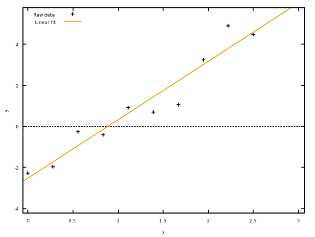

Linear fits are super easy and fairly robust, and also give statistical goodness-of-fit measurements
which can be extremely useful when analysing your data. The power of gnuplot's fitting algorithms are
even more clear when considering nonlinear fits, which are somewhat tricky to implement and not well
supported by many common programs.

Let's look at another set of noisy data, this time with a clear periodic structure:
```
#periodic.dat
#x          y
-3.14       0.7340049209405408
-2.69       0.9595473520190202
-2.24       0.6220387687186373
-1.79       0.1562411733785349
-1.34       -0.708672547081825
-0.89       -0.9994391197766682
-0.44       -0.6664953617196516
0           0.26607170984999007
0.44        0.9192318773207327
0.89        0.8917499961805632
1.34        0.9708691749801293
1.79        -0.5586074806127096
2.24        -0.9396434545238109
2.69        -0.6098145084879657
3.14        0.9791578865881471
```


For periodic data like this, a sinusoidal curve is a natural choice of fitting function. Let's define
our function with free parameters for the amplitude, frequency and phase:

```
f(x) = amp*sin(freq*x + phase)
fit f(x) "periodic.dat" via amp,freq,phase
```

which gives the output:

```
iter      chisq       delta/lim  lambda   amp           freq          phase        
   0 1.8014796290e+01   0.00e+00  9.66e-01    1.030402e+00   1.000000e+00   1.000000e+00
   1 8.8717970657e+00  -1.03e+05  9.66e-02    4.008161e-02   1.206675e+00   7.219334e-01
   * 8.9296657920e+00   6.48e+02  9.66e-01    2.466654e-01   7.530360e+00  -3.825791e+00
   2 7.0098731936e+00  -2.66e+04  9.66e-02    2.089800e-01   1.580520e+00   6.074243e-01
   * 1.2429866806e+01   4.36e+04  9.66e-01    6.883115e-01   3.076662e+00  -4.618866e-01
   3 6.2150602990e+00  -1.28e+04  9.66e-02    6.562097e-01   2.409032e+00   3.096356e-01
   4 3.3405311172e+00  -8.61e+04  9.66e-03    6.733933e-01   1.740402e+00   1.449568e-01
   5 1.9406758454e+00  -7.21e+04  9.66e-04    9.116653e-01   2.084146e+00   3.787007e-01
   6 1.4219845960e+00  -3.65e+04  9.66e-05    1.006998e+00   1.952006e+00   2.991154e-01
   7 1.3964835044e+00  -1.83e+03  9.66e-06    1.029539e+00   1.975956e+00   3.227153e-01
   8 1.3963752200e+00  -7.75e+00  9.66e-07    1.030381e+00   1.974359e+00   3.212531e-01
   9 1.3963747219e+00  -3.57e-02  9.66e-08    1.030403e+00   1.974441e+00   3.213342e-01
iter      chisq       delta/lim  lambda   amp           freq          phase        

After 9 iterations the fit converged.
final sum of squares of residuals : 1.39637
rel. change during last iteration : -3.56728e-07

degrees of freedom    (FIT_NDF)                        : 12
rms of residuals      (FIT_STDFIT) = sqrt(WSSR/ndf)    : 0.341123
variance of residuals (reduced chisquare) = WSSR/ndf   : 0.116365

Final set of parameters            Asymptotic Standard Error
=======================            ==========================
amp             = 1.0304           +/- 0.128        (12.43%)
freq            = 1.97444          +/- 0.05834      (2.955%)
phase           = 0.321334         +/- 0.1185       (36.88%)

correlation matrix of the fit parameters:
                amp    freq   phase  
amp             1.000 
freq            0.085  1.000 
phase          -0.039 -0.061  1.000
```

We can see that the nonlinear fit takes slightly longer to converge than the linear example (although
it's still relatively quick), and gives values for the fit parameters to an "okay" degree of accuracy
(`~10% - 30%`, again likely due to the quality of the data). 
The fitted parameters are also consistent with the "true" values I used to generate 
the data (`amp = 1`, `freq = 2`, `phase = 0.25`), and visually fits the data fairly well:

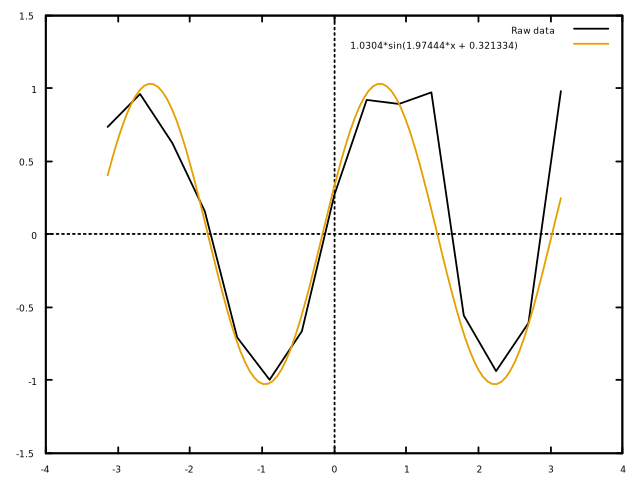

This example should hopefully serve to demonstrate that gnuplot makes fitting linear and nonlinear
functions to data no more difficult than plotting that same data. It's not quite a "one-click" process,
as some care is required when selecting the fitting function: using too many or too few free parameters
can slow down or hamper convergence, as can choosing the wrong functional form of the fit. This process
works best when you have some *a priori* guess as to the data's functional form (e.g. based on the
physics underlying the data set), and you may need to choose different weighting for data points via the
`errors` keyword to `fit`. If you find yourself needing to do curve-fitting, it's worth having a read
over [this guide](https://www.facm.ucl.ac.be/cooperation/Vietnam/WBI-Vietnam-October-2011/Modelling/RegressionBook.pdf)
first for an idea of best-practices and pitfalls.

# Further reading
This guide is intended to be a sort of "crash-course" introduction to gnuplot, so there are several
important topics in data visualisation which we haven't touched on. In particular, I've deliberately
left out 3D visualisations as they can be extremely tricky to get right and are a large enough topic to
warrant their own guide. I have tried to include general visualisation best-practices throughout the
guide, but the topic of visualisation is vast and this guide is meant to be short. To that end, here are
some useful resources you might like to familiarise yourself with in order to get the most out of your
plots and figures:

- Claus Wilke, *Fundamentals of Data Visualization*, (2019) O'Reilly Media. URL:
  <https://clauswilke.com/dataviz/>
    * This book does not focus on a single plotting program, instead aiming to be a general guide to
      making *good* plots which efficiently convey the desired information. It contains a number of real
      examples and covers a wide-range of visualisation techniques beyond those covered in this guide.
      It is freely available on the author's website under a [Creative Commons
      license](https://creativecommons.org/licenses/by-nc-nd/4.0/legalcode).
- Phillip Janert, *Gnuplot in Action: Understanding Data with Graphs*, (2009) Manning Publications. URL:
  <https://www.manning.com/books/gnuplot-in-action>
    * This book serves as both a reference manual for gnuplot, as well as a "cookbook" containing a lot
      of example scripts you can modify to suit your purposes. The book is not freely available, but the
      UQ Library has a physical copy in stock (as of May 2021).
- National Institute of Standards and Technology (NIST), *eHandbook of Statistical Methods*, (2012).
  URL: <https://www.itl.nist.gov/div898/handbook/index.htm>
    * Handbook of methods and best-practices for statistics and data analysis in engineering. Of
      particular interest to this guide is ["Chapter 1: Exploratory Data 
      Analysis"](https://www.itl.nist.gov/div898/handbook/index.htm), which includes procedures and
      discussions of analysis techniques (both graphical and non-graphical) to uncover the underlying
      structure, distribution and important features of a data set. 
- Harvey Motulsky & Arthur Christopoulos, *Fitting Models to Biological Data using Linear and Nonlinear
  Regression*, (2003) GraphPad Software, Inc. URL:
  <https://www.facm.ucl.ac.be/cooperation/Vietnam/WBI-Vietnam-October-2011/Modelling/RegressionBook.pdf>
    * Guide to curve fitting and data interpolation. Even though the examples are bioscience-themed, the
      book still provides a lot of best-practices and pitfalls to avoid when fitting a model to your
      data.
